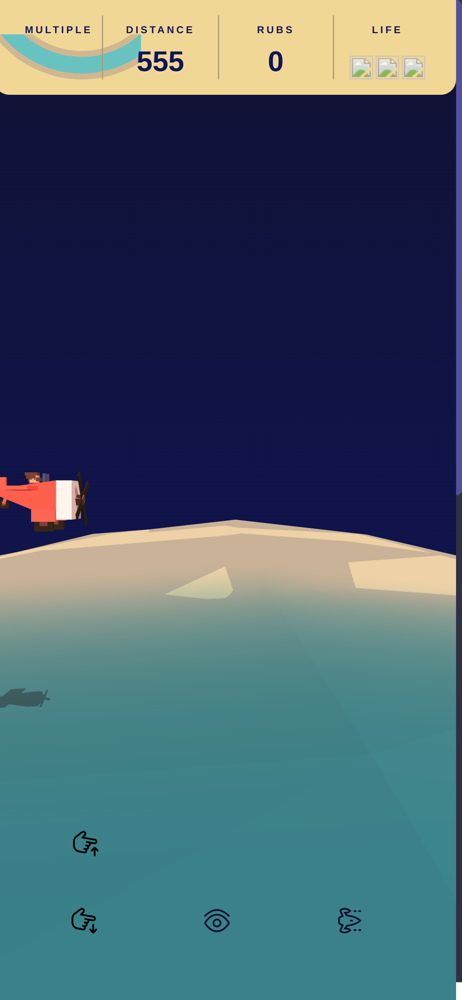
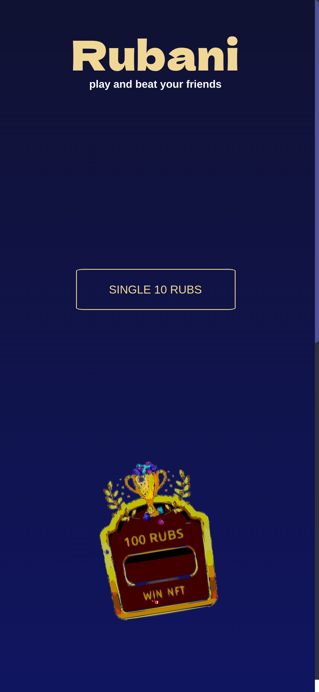

# Rubani Game

A 3D web-based game where players collect $RUBS tokens and win NFT prizes. Built with Three.js, Angular, and hedera blockchain integration.

## Overview

Rubani is an interactive 3D game that combines gaming mechanics with cryptocurrency features. Players can:
- Collect $RUBS tokens
- Win NFT prizes by collecting 100 $RUBS
- Interact with various 3D vehicles (drones, airplanes, cars)
- Connect their cryptocurrency wallets
- Earn and spend $RUBS while playing

## Technologies Used

- Three.js (3D graphics)
- Angular (Frontend framework)
- GSAP (Animations)
- Blockchain Integration (TON and HBAR)

## Prerequisites

- Node.js (v14 or higher)
- npm or yarn
- A modern web browser
- A cryptocurrency wallet (for blockchain features)
- Docker (optional, for containerized deployment)

## Installation

### Option 1: Local Installation

1. Clone the repository:
```bash
git clone https://github.com/games/rubani.git
cd rubani
```

2. Install dependencies:
```bash
npm install
# or
yarn install
```

### Option 2: Docker Installation

1. Build the Docker image:
```bash
docker build -t rubani .
```

2. Run the container:
```bash
# Development mode with hot reload
docker run -it --rm \
  -p 4200:4200 \
  -e NODE_ENV=development \
  -v $(pwd):/app \
  -v /app/node_modules \
  rubani

# Production mode
docker run -it --rm \
  -p 8123:8123 \
  -e NODE_ENV=production \
  rubani
```

#### Docker Development Notes:
- The `-v $(pwd):/app` flag mounts your local directory to enable hot reload
- The `-v /app/node_modules` flag preserves container node_modules
- Hot reload is enabled by default in development mode
- Changes to your local files will automatically trigger rebuilds

#### Docker Production Notes:
- The production build is optimized for performance
- Static files are served using http-server
- No hot reload is available in production mode

## Running the Game

### Local Development

1. Start the development server:
```bash
npm start
# or
yarn start
```

2. Open your browser and navigate to:
```
http://localhost:4200
```

### Docker Development

1. The development server will automatically start when running the container in development mode
2. Access the game at:
```
http://localhost:4200
```
3. Hot reload is enabled - changes to your local files will automatically trigger rebuilds

### Docker Production

1. Access the production build at:
```
http://localhost:8123
```

## Game Screenshots

### Game Play Interface

The main game interface where players can:
- Navigate the 3D environment
- Collect $RUBS tokens
- Interact with vehicles
- View their current token balance

### Token Burning Interface

The token burning interface where players can:
- Burn their collected $RUBS tokens
- Earn NFT rewards
- Track their progress towards rewards
- View their burning history

## Development

- The game's main components are in the `src` directory
- 3D models and assets are loaded from external sources
- Blockchain integration is handled through Bitsoko's services

## Contributing

1. Fork the repository
2. Create your feature branch (`git checkout -b feature/AmazingFeature`)
3. Commit your changes (`git commit -m 'Add some AmazingFeature'`)
4. Push to the branch (`git push origin feature/AmazingFeature`)
5. Open a Pull Request

## License

This project is licensed under the MIT License - see the LICENSE file for details.

## Author

- **Allan** - Initial work

## Acknowledgments

- Sound effects from [zapsplat.com](https://www.zapsplat.com) and [freesound.org](https://freesound.org)
- Three.js community for 3D graphics support
- Bitsoko for blockchain integration services
